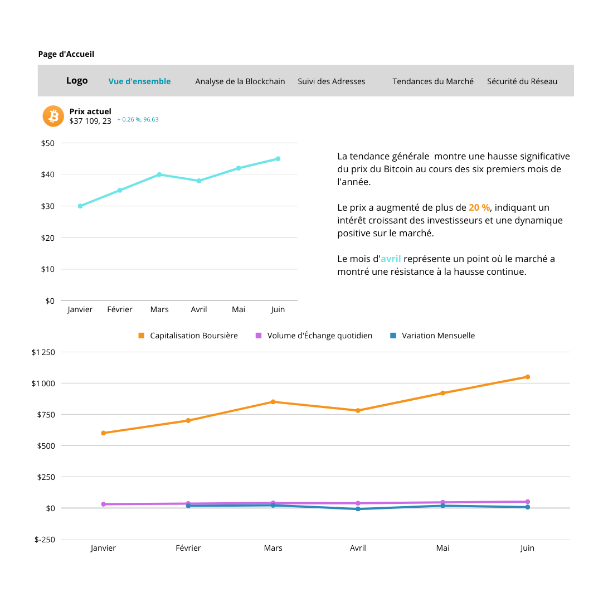

# UI/UX - BitInfoDash

Ce dossier contient les wireframes et les maquettes pour l'interface utilisateur de BitInfoDash.

## Wireframes

### Page d'Accueil

La page d'accueil de BitInfoDash est conçue pour fournir une expérience utilisateur claire et intuitive. Voici les éléments clés de la page :

#### Barre de Navigation Supérieure :

- **Logo BitInfoDash :** Positionné à gauche de la barre de navigation.
- **Liens de Section :** Liens vers différentes sections du tableau de bord, notamment Vue d'Ensemble Bitcoin, Blockchain, Adresses, Tendances, et Sécurité.

#### Section Centrale :

- **Prix du Bitcoin :** Affiche le prix actuel du Bitcoin.
- **Graphique Historique :** Présente un graphique illustrant l'historique du prix du Bitcoin.

#### Graphique de Données :

- **Capitalisation Boursière :** Graphique montrant la capitalisation boursière du Bitcoin.
- **Volume d'Échange :** Graphique illustrant le volume d'échange.
- **Variations Récentes :** Graphique présentant les variations récentes du Bitcoin.
